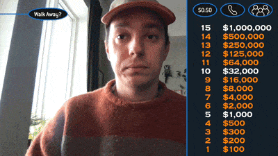

# Who Wants To Be A Millionaire Graphics Package for OBS

This is a web-based graphics overlay for OBS that lets you host Who Wants To Be A Millionaire-style trivia with your friends over Zoom. I got a few good Zoom calls out of it during the Covid-19 pandemic. While it's a little hacky there's some dumb fun to be had with it. Which is why I'm open-sourcing it despite that.

## How to run the project
All instructions below on how to get it running are for a Mac OS/X setup. There are Windows (and possibly Linux) alternatives to everything but those are unchartered waters.

### Requirements
- [Node](https://nodejs.org/en/) to compile
- [OBS](https://obsproject.com/) to overlay and stream
- [Soundflower](https://github.com/mattingalls/Soundflower) to route audio

### Setting up the local server
Once you've cloned the repo, you'll want to run `npm install`. Once completed, run `npm run start` to start locally hosting a website with the graphics package on it.

### Creating games
Games are stored as CSV files inside the `src/data/` folder. To create a game, you'll simply need to edit or duplicate an existing game making sure to keep to the same csv format and the existing file name convention. You'll also need to add a corresponding fastest finger question in the `ff.csv` file.

Games can be reached by visting `http://localhost:5000?game=1`, changing the number at the end of the url for the corresponding game number.

### Setting up in OBS
To setup in OBS, create a new scene at 1280x720 and add two sources. One being a browser pointing to `http://localhost:5000?game=1` (with control audio via OBS selected) and another being your webcam feed. For audio, select your monitoring device as Soundflower within OBS's audio settings.

You'll also want to mix the browser audio a little lower, otherwise you'll be shouting over the sound effects.

When you're ready click "Start Virtual Camera"

### Hosting the game
Now you're good to run a game. Make sure within Zoom to setup OBS as your webcam and Soundflower as your audio source. To progress the game, right click on your Browser source and select 'Interact'. This should open a new window with a large grey box (this serves as a representation of the browser window). A single click will start the game and progress you to the "fastest finger" round. Clicking on the question boxes will reveal the answer. Clicking on the answers will remove them and take you to a blank screen. You can then click anywhere to start the game properly.

At first the game will show "the board" which is the panel that pops out on the right-hand-side. Here you are able to interact with the lifelines, show the current status of the game and click walk away to end the game. To toggle and to bring back at any point, you can click on the top third of the window.

Now you should see the first question. You can click on an answer once to "lock it in" and then again to reveal the answer. Make sure to click on the same answer twice (otherwise the game gets confused, I should fix this. Again though, it's a hack). The game will then progress as the show does, with the subsequent questions until the player gets a question wrong or they reach a million.

During that journey, the player can choose to use their lifelines. If they do, bring up the board and select the chosen lifeline. **50-50** will randomly select two answers to remove (You can choose to "ask the computer" just like Chris Tarrant used to, as you're technically not wrong). **Phone a Friend** will bring up a timer, which will only start when you click it. It shoudl automatically remove itself after 30 seconds. It's up to you to interpet how this lifeline works, I've been using it as "Ask a friend who is also on the Zoom call" lifeline. Finally, there is the **Ask The Audience** lifeline which will just throw up a random animation of voting bars from the show. At this point, I would normally create a Zoom poll for the question and let the non-playing players vote.

Once the game is over, you should change the number in the Browser URL to start a new game!

## Editing The Graphics
If you wish to edit the graphics in anyway, the `npm run start` command also watches for changes within the `src` folder. In here you'll find handlebars templates, sass partials and javascript modules that make up the graphics package.

## Notice
The format, sounds and questions used from Who Wants to Be a Millionaire are not mine, nor do I claim any involvement in their creation. The materials are used under Fair Use for academic and educational purposes, and should not be redistributed otherwise without permission from their creators.